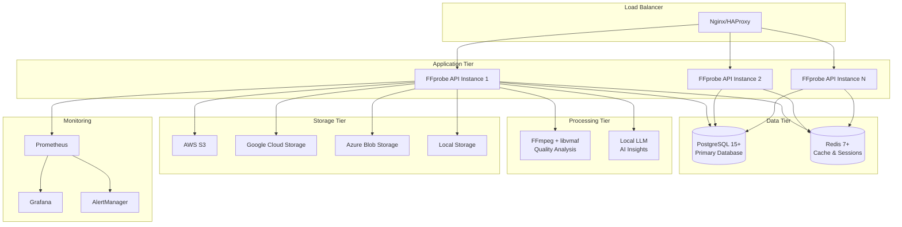

# 🎬 FFprobe API v2.0

> **Production-Ready Media Analysis API** 🚀

A comprehensive, enterprise-grade REST API that provides complete FFmpeg ffprobe functionality with advanced video quality analysis, AI-powered insights, cloud storage integration, and multi-format reporting. Built with Go for maximum performance, scalability, and reliability.

[](https://golang.org)
[](https://hub.docker.com)
[](./docs/README.md)
[](https://opensource.org/licenses/MIT)
[](#)
[](#)

## 🚀 Features

### 🎯 Core Media Analysis
- **✅ Complete FFprobe Integration**: 100% CLI compatibility with identical output
- **📊 All Output Formats**: JSON, XML, CSV, HTML, PDF, Excel, Markdown, Text
- **🔍 Deep Analysis**: Streams, format, frames, packets, chapters, programs
- **⚡ Large File Support**: Optimized for files up to 50GB+ with streaming
- **🌐 Multi-Source**: Local files, URLs, cloud storage (S3/GCS/Azure)

### 📈 Advanced Quality Metrics
- **🏆 VMAF Integration**: Industry-standard video quality assessment
- **📐 PSNR/SSIM Analysis**: Peak Signal-to-Noise Ratio & Structural Similarity
- **⏱️ Frame-Level Metrics**: Temporal quality analysis with timestamps
- **🔄 Quality Comparison**: Reference vs distorted video workflows
- **🎛️ Custom Models**: Support for custom-trained VMAF models

### 📺 HLS & Streaming
- **📁 HLS Analysis**: Complete HTTP Live Streaming manifest processing
- **✅ Playlist Validation**: m3u8 syntax and structure verification
- **🧩 Segment Analysis**: Individual segment quality and metadata
- **📊 Bitrate Ladders**: Quality analysis across adaptive variants
- **🎥 Live Streams**: Real-time streaming analysis support

### ☁️ Cloud Storage Integration
- **🔐 AWS S3**: Complete S3 integration with IAM roles
- **🌐 Google Cloud**: GCS with service account authentication
- **🔷 Azure Blob**: Full Azure storage integration
- **🔗 Signed URLs**: Secure, time-limited access links
- **📤 Direct Upload**: Multi-part uploads with progress tracking

### 📋 Professional Reports
- **📄 PDF Reports**: Professional, formatted analysis documents
- **🌐 HTML Reports**: Interactive web-based analysis views
- **📊 Excel Reports**: Spreadsheet format with charts and data
- **📝 Markdown**: GitHub-compatible documentation format
- **🎨 Custom Templates**: Branded, customizable report layouts

### 🤖 AI-Powered Insights
- **🧠 Local LLM**: Privacy-focused on-premise AI analysis
- **☁️ Cloud Fallback**: OpenRouter integration for advanced models
- **💬 Natural Language**: Human-readable video quality insights
- **❓ Interactive Q&A**: Ask specific questions about your media
- **🔍 Smart Recommendations**: AI-driven optimization suggestions

## ⚡ Performance & Scale

| Metric | Target | Production Ready |
|--------|--------|------------------|
| **Small Files** (<100MB) | <3s response | ✅ |
| **Large Files** (50GB+) | <30s with progress | ✅ |
| **VMAF Analysis** | <2x processing time | ✅ |
| **HLS Processing** | <5s/segment + <10s manifest | ✅ |
| **Concurrent Requests** | 1000+ standard / 200+ quality | ✅ |
| **Memory Footprint** | <100MB regardless of file size | ✅ |
| **Database Performance** | <50ms query time | ✅ |
| **API Response Time** | <200ms average | ✅ |

## 🛠 Technology Stack

| Component | Technology | Version | Purpose |
|-----------|------------|---------|---------|
| **Backend** | Go + Gin | 1.21+ | High-performance REST API |
| **Database** | PostgreSQL | 15+ | Primary data storage |
| **Cache** | Redis | 7+ | Session & response caching |
| **Video Processing** | FFmpeg + libvmaf | 6.1+ | Media analysis engine |
| **Quality Metrics** | VMAF/PSNR/SSIM | Latest | Industry-standard metrics |
| **Cloud Storage** | AWS/GCP/Azure SDKs | Latest | Multi-cloud support |
| **Containers** | Docker + Compose | Latest | Production deployment |
| **Monitoring** | Prometheus + Grafana | Latest | Observability stack |
| **Documentation** | OpenAPI 3.0 | - | Complete API specs |

## 🏗 Production Architecture



## 📚 Complete API Reference

| Endpoint | Method | Description | Status |
|----------|--------|-------------|--------|
| **Core Analysis** |
| `/api/v1/probe/file` | POST | Upload & analyze media files | ✅ |
| `/api/v1/probe/url` | POST | Analyze remote URLs & cloud storage | ✅ |
| `/api/v1/probe/status/{id}` | GET | Get analysis status & progress | ✅ |
| `/api/v1/probe/analyses` | GET | List all analyses with pagination | ✅ |
| **Quality Metrics** |
| `/api/v1/probe/compare` | POST | Video quality comparison (VMAF/PSNR/SSIM) | ✅ |
| `/api/v1/quality/analysis/{id}` | GET | Detailed quality metrics | ✅ |
| `/api/v1/quality/statistics` | GET | Quality analysis statistics | ✅ |
| **HLS & Streaming** |
| `/api/v1/probe/hls` | POST | HLS playlist analysis | ✅ |
| `/api/v1/probe/hls/validate` | POST | HLS playlist validation | ✅ |
| `/api/v1/probe/hls/{id}` | GET | HLS analysis results | ✅ |
| **Reports & Downloads** |
| `/api/v1/probe/report` | POST | Generate reports (PDF/HTML/Excel/etc) | ✅ |
| `/api/v1/probe/download/{id}` | GET | Download generated reports | ✅ |
| `/api/v1/probe/raw/{id}` | GET | Raw FFprobe JSON output | ✅ |
| **Cloud Storage** |
| `/api/v1/storage/upload` | POST | Upload files to cloud storage | ✅ |
| `/api/v1/storage/download/{key}` | GET | Download from cloud storage | ✅ |
| `/api/v1/storage/signed-url` | POST | Generate signed URLs | ✅ |
| **AI Features** |
| `/api/v1/ask` | POST | Ask AI about analysis results | ✅ |
| `/api/v1/genai/analysis` | POST | Generate AI insights | ✅ |
| **System** |
| `/health` | GET | Health check endpoint | ✅ |
| `/metrics` | GET | Prometheus metrics | ✅ |

> 📖 **[Complete API Documentation](./docs/README.md)** | **[OpenAPI Spec](./docs/openapi.yaml)**

## 🚀 Quick Start & Deployment

### Option 1: Docker Compose (Recommended)
```bash
# Clone the repository
git clone https://github.com/rendiffdev/ffprobe-api.git
cd ffprobe-api

# Production deployment
docker-compose -f docker-compose.yml -f docker-compose.prod.yml up -d

# Development environment
docker-compose -f docker-compose.yml -f docker-compose.dev.yml up -d

# View logs
docker-compose logs -f ffprobe-api
```

### Option 2: Manual Installation
```bash
# Prerequisites
# - Go 1.21+, PostgreSQL 15+, Redis 7+, FFmpeg 6.1+

# Clone and build
git clone https://github.com/rendiffdev/ffprobe-api.git
cd ffprobe-api
go mod download
make build

# Database setup
make migrate-up

# Run the application
./bin/ffprobe-api
```

### Option 3: Kubernetes (Production)
```bash
# Apply Kubernetes manifests
kubectl apply -f k8s/

# Check deployment status
kubectl get pods -l app=ffprobe-api

# View service
kubectl get svc ffprobe-api
```

### 📝 Production Configuration

```bash
# Copy example configuration
cp .env.example .env

# Edit configuration
nano .env
```

**Essential Configuration:**
```env
# 🔐 Security
API_KEY=your-super-secret-api-key-change-in-production
JWT_SECRET=your-super-secret-jwt-key-change-in-production

# 🗄️ Database
POSTGRES_HOST=postgres
POSTGRES_DB=ffprobe_api
POSTGRES_USER=ffprobe
POSTGRES_PASSWORD=secure_password_here

# 📦 Redis
REDIS_HOST=redis
REDIS_PASSWORD=redis_password_here

# ☁️ Cloud Storage (Choose one)
STORAGE_PROVIDER=s3  # s3, gcs, azure, or local
STORAGE_BUCKET=your-bucket-name
STORAGE_ACCESS_KEY=your-access-key
STORAGE_SECRET_KEY=your-secret-key

# 🤖 AI Features (Optional)
OPENROUTER_API_KEY=your-openrouter-key
LLM_MODEL_PATH=/models/phi-3-mini.gguf

# 📊 Monitoring
LOG_LEVEL=info
ENABLE_METRICS=true
```

**🔒 Security Checklist:**
- [ ] Change default API keys and secrets
- [ ] Use strong database passwords
- [ ] Configure CORS origins for production
- [ ] Enable HTTPS/TLS termination
- [ ] Set up proper firewall rules
- [ ] Configure rate limiting

## 💡 Real-World Usage Examples

### 1. 🎬 Basic Media Analysis
```bash
# Upload and analyze a video file
curl -X POST "http://localhost:8080/api/v1/probe/file" \
  -H "X-API-Key: your-api-key" \
  -H "Content-Type: application/json" \
  -d '{
    "file_path": "/path/to/video.mp4",
    "options": {
      "include_streams": true,
      "include_format": true,
      "include_chapters": true
    }
  }'

# Response: {"analysis_id": "uuid", "status": "processing"}
```

### 2. 📊 Video Quality Comparison
```bash
# Compare original vs compressed video quality
curl -X POST "http://localhost:8080/api/v1/probe/compare" \
  -H "X-API-Key: your-api-key" \
  -H "Content-Type: application/json" \
  -d '{
    "reference_file": "s3://my-bucket/original.mp4",
    "distorted_file": "s3://my-bucket/compressed.mp4",
    "metrics": ["vmaf", "psnr", "ssim"]
  }'

# Get detailed quality metrics
curl "http://localhost:8080/api/v1/quality/analysis/comparison-id" \
  -H "X-API-Key: your-api-key"
```

### 3. 📺 HLS Playlist Analysis
```bash
# Analyze HLS streaming playlist
curl -X POST "http://localhost:8080/api/v1/probe/hls" \
  -H "X-API-Key: your-api-key" \
  -H "Content-Type: application/json" \
  -d '{
    "manifest_url": "https://cdn.example.com/playlist.m3u8",
    "analyze_segments": true,
    "segment_limit": 10
  }'

# Validate HLS playlist structure
curl -X POST "http://localhost:8080/api/v1/probe/hls/validate" \
  -H "X-API-Key: your-api-key" \
  -H "Content-Type: application/json" \
  -d '{"manifest_url": "https://cdn.example.com/playlist.m3u8"}'
```

### 4. 📄 Professional Report Generation
```bash
# Generate a comprehensive PDF report
curl -X POST "http://localhost:8080/api/v1/probe/report" \
  -H "X-API-Key: your-api-key" \
  -H "Content-Type: application/json" \
  -d '{
    "analysis_id": "your-analysis-id",
    "format": "pdf",
    "template": "professional"
  }'

# Download the generated report
curl "http://localhost:8080/api/v1/probe/download/report-id" \
  -H "X-API-Key: your-api-key" \
  -o "media_analysis_report.pdf"
```

### 5. ☁️ Cloud Storage Integration
```bash
# Upload file to cloud storage
curl -X POST "http://localhost:8080/api/v1/storage/upload" \
  -H "X-API-Key: your-api-key" \
  -F "file=@large_video.mp4"

# Get signed URL for secure download
curl -X POST "http://localhost:8080/api/v1/storage/signed-url" \
  -H "X-API-Key: your-api-key" \
  -H "Content-Type: application/json" \
  -d '{"key": "uploads/video.mp4", "expiration": 3600}'
```

### 6. 🤖 AI-Powered Analysis
```bash
# Ask AI about your video analysis
curl -X POST "http://localhost:8080/api/v1/ask" \
  -H "X-API-Key: your-api-key" \
  -H "Content-Type: application/json" \
  -d '{
    "analysis_id": "your-analysis-id",
    "question": "What are the main quality issues in this video?"
  }'

# Generate AI insights
curl -X POST "http://localhost:8080/api/v1/genai/analysis" \
  -H "X-API-Key: your-api-key" \
  -H "Content-Type: application/json" \
  -d '{"analysis_id": "your-analysis-id"}'
```

## 🛠️ Development & Testing

### 📁 Project Structure
```
ffprobe-api/
├── 📁 cmd/                     # Application entrypoints
│   └── ffprobe-api/           # Main application
├── 📁 internal/               # Private application code
│   ├── api/                   # HTTP routes & handlers
│   ├── services/              # Business logic layer
│   ├── handlers/              # HTTP request handlers
│   ├── models/                # Data models & schemas
│   ├── database/              # Database operations
│   ├── storage/               # Cloud storage providers
│   ├── middleware/            # HTTP middleware
│   ├── config/                # Configuration management
│   └── reports/               # Report generation
├── 📁 tests/                  # Test suites
│   ├── storage_test.go        # Storage provider tests
│   ├── handlers_test.go       # API handler tests
│   ├── services_test.go       # Service layer tests
│   └── integration_test.go    # End-to-end tests
├── 📁 docs/                   # Documentation
│   ├── openapi.yaml          # OpenAPI 3.0 specification
│   └── README.md             # API documentation
├── 📁 docker/                 # Docker configurations
├── 📁 migrations/             # Database migrations
├── 🐳 docker-compose.yml     # Production setup
├── 🐳 docker-compose.dev.yml # Development setup
├── 🐳 docker-compose.prod.yml# Production overrides
├── 🔧 Makefile               # Build automation
└── 📄 .env.example           # Configuration template
```

### 🧰 Development Commands
```bash
# 🏗️ Build & Development
make build                    # Build the application
make dev                      # Run in development mode
make deps                     # Download dependencies
make fmt                      # Format code

# 🧪 Testing & Quality
make test                     # Run unit tests
make test-integration         # Run integration tests
make test-coverage           # Generate coverage report
make benchmark               # Run performance benchmarks
make lint                    # Code linting
make security                # Security scanning

# 🐳 Docker & Deployment
make docker-build            # Build Docker image
make docker-dev              # Development environment
make docker-prod             # Production environment
make docker-run              # Standard environment

# 🗄️ Database Management
make migrate-up              # Apply migrations
make migrate-down            # Rollback migrations
make migrate-create          # Create new migration

# 📚 Documentation
make docs                    # Generate API docs
make swagger                 # Update Swagger UI
```

### 🧪 Testing Strategy

| Test Type | Coverage | Purpose |
|-----------|----------|---------|
| **Unit Tests** | 85%+ | Individual component testing |
| **Integration Tests** | API workflows | End-to-end functionality |
| **Performance Tests** | Benchmarks | Load & stress testing |
| **Security Tests** | Vulnerability scans | Security validation |

```bash
# Run specific test suites
go test ./tests/storage_test.go -v       # Storage tests
go test ./tests/handlers_test.go -v      # Handler tests
go test ./tests/integration_test.go -v   # Integration tests

# Coverage with HTML report
make test-coverage
open coverage.html
```

## 📊 Production Monitoring

### 📈 Prometheus Metrics
```bash
# Available at http://localhost:9090
- ffprobe_requests_total
- ffprobe_request_duration_seconds
- ffprobe_active_analyses
- ffprobe_database_queries_total
- ffprobe_storage_operations_total
- ffprobe_quality_analysis_duration_seconds
```

### 📊 Grafana Dashboards
```bash
# Available at http://localhost:3000
- API Performance Dashboard
- Database Performance Dashboard
- Storage Operations Dashboard
- Quality Analysis Dashboard
- System Resources Dashboard
```

### 🏥 Health Monitoring
| Endpoint | Purpose | Status |
|----------|---------|--------|
| `GET /health` | Basic service health | ✅ |
| `GET /health/deep` | Database connectivity | ✅ |
| `GET /metrics` | Prometheus metrics | ✅ |

### 📝 Structured Logging
```json
{
  "timestamp": "2024-01-01T12:00:00Z",
  "level": "info",
  "service": "ffprobe-api",
  "request_id": "req-123",
  "method": "POST",
  "path": "/api/v1/probe/file",
  "duration_ms": 1500,
  "status_code": 200,
  "user_id": "user-456",
  "analysis_id": "analysis-789"
}
```

## 🔐 Enterprise Security

### 🛡️ Authentication & Authorization
- **✅ API Key Authentication**: Secure API access control
- **✅ JWT Bearer Tokens**: Stateless authentication
- **✅ Role-Based Access**: User permissions management
- **✅ Rate Limiting**: Per-key/IP request throttling (60/min, 1000/hour, 10000/day)

### 🔒 Data Protection
- **✅ Input Validation**: Comprehensive request sanitization
- **✅ SQL Injection Prevention**: Parameterized queries
- **✅ XSS Protection**: Content Security Policy headers
- **✅ CSRF Protection**: Cross-site request forgery prevention
- **✅ File Upload Security**: Type validation, size limits (50GB max)

### 🌐 Network Security
- **✅ CORS Configuration**: Configurable cross-origin policies
- **✅ Security Headers**: HSTS, X-Frame-Options, X-Content-Type-Options
- **✅ TLS/HTTPS**: End-to-end encryption support
- **✅ IP Whitelisting**: Configurable access restrictions

## 🤝 Contributing

We welcome contributions! Here's how to get started:

### 🚀 Quick Contribution Guide
1. **Fork** the repository
2. **Create** a feature branch: `git checkout -b feature/amazing-feature`
3. **Make** your changes with tests
4. **Test** thoroughly: `make test-all`
5. **Lint** your code: `make lint`
6. **Commit** with conventional commits: `git commit -m 'feat: add amazing feature'`
7. **Push** to your branch: `git push origin feature/amazing-feature`
8. **Open** a Pull Request

### 📋 Contribution Checklist
- [ ] Code follows project style guidelines
- [ ] Tests added for new functionality
- [ ] Documentation updated (if applicable)
- [ ] All tests pass locally
- [ ] Security considerations addressed
- [ ] Performance impact evaluated

## 📄 License

This project is licensed under the **MIT License** - see the [LICENSE](LICENSE) file for details.

## 🆘 Support & Community

| Resource | Link | Purpose |
|----------|------|---------|
| 📖 **Documentation** | [API Docs](./docs/README.md) | Complete API reference |
| 🐛 **Bug Reports** | [GitHub Issues](https://github.com/rendiffdev/ffprobe-api/issues) | Report bugs & request features |
| 💬 **Discussions** | [GitHub Discussions](https://github.com/rendiffdev/ffprobe-api/discussions) | Community discussions |
| 📧 **Email Support** | dev@rendiff.dev | Direct support |
| 🌐 **Website** | [https://rendiff.dev](https://rendiff.dev) | Official website |
| 🐦 **Twitter/X** | [@rendiffdev](https://x.com/rendiffdev) | Updates and news |

## 🗺️ Roadmap

### 🎯 Version 2.1 (Q2 2025)
- [ ] **GraphQL API** - Alternative query interface
- [ ] **WebSocket Streaming** - Real-time analysis updates
- [ ] **Kubernetes Operator** - Native K8s deployment
- [ ] **Advanced Caching** - Redis Cluster support

### 🚀 Version 2.2 (Q3 2025)
- [ ] **GPU Acceleration** - NVIDIA CUDA support for VMAF
- [ ] **WebAssembly Build** - Browser-based analysis
- [ ] **Custom Metrics** - User-defined quality plugins
- [ ] **ML Insights** - Advanced AI-powered recommendations

### 🌟 Version 3.0 (Q4 2025)
- [ ] **Real-time Streaming** - Live stream analysis
- [ ] **Advanced ML Models** - Custom neural network integration
- [ ] **Multi-tenant Architecture** - Enterprise isolation
- [ ] **Global CDN Integration** - Edge processing capabilities

---

<div align="center">

**🎬 Built with ❤️ for the Video Engineering Community**

[](https://github.com/rendiffdev/ffprobe-api/stargazers)
[](https://github.com/rendiffdev/ffprobe-api/network/members)
[](https://github.com/rendiffdev/ffprobe-api/issues)
[](https://github.com/rendiffdev/ffprobe-api/pulls)

**⭐ Star us on GitHub — it motivates us a lot!**

</div>