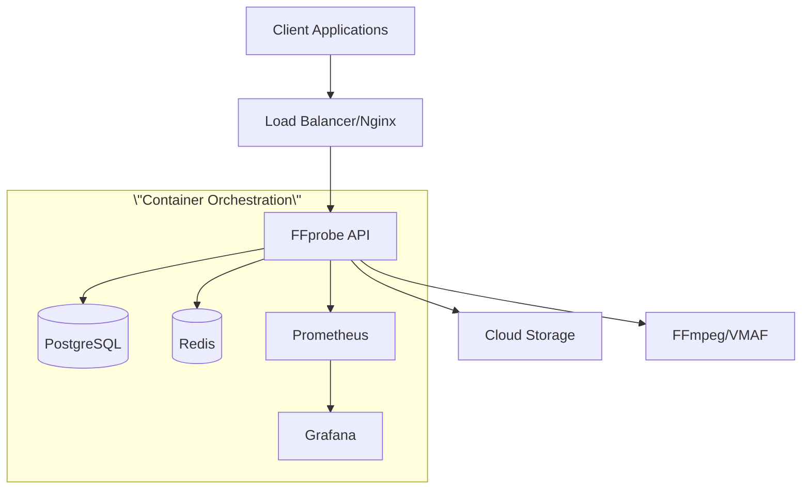

# 🎬 FFprobe API

> **Enterprise-Grade Media Analysis API with Netflix VMAF Integration**

[](https://golang.org)
[](https://hub.docker.com)
[](#)
[](#)
[](https://opensource.org/licenses/MIT)

A comprehensive, production-ready REST API that provides complete FFmpeg ffprobe functionality with advanced video quality analysis, AI-powered insights, cloud storage integration, and multi-format reporting. Built with Go for maximum performance, scalability, and reliability.

## ✨ Features

### 🎯 **Core Media Analysis**
- **Complete FFprobe Integration** - 100% CLI compatibility with identical output
- **All Output Formats** - JSON, XML, CSV, HTML, PDF, Excel, Markdown, Text
- **Deep Analysis** - Streams, format, frames, packets, chapters, programs
- **Large File Support** - Optimized for files up to 50GB+ with streaming
- **Multi-Source Support** - Local files, URLs, cloud storage (S3/GCS/Azure)
- **Enhanced Storage Options** - Local NAS, SMB/CIFS, NFS, FTP support

### 📈 **Advanced Quality Metrics**
- **VMAF Integration** - Industry-standard video quality assessment
- **PSNR/SSIM Analysis** - Peak Signal-to-Noise Ratio & Structural Similarity
- **Frame-Level Metrics** - Temporal quality analysis with timestamps
- **Quality Comparison** - Reference vs distorted video workflows
- **Custom Models** - Support for custom-trained VMAF models

### 🤖 **AI-Powered Analysis**
- **Automatic LLM Reports** - All analysis includes AI-generated insights
- **Flexible LLM Options** - Local Ollama, cloud OpenRouter, or both with fallback
- **Multiple Model Support** - Mistral 7B, Qwen2, Phi3, Gemma2, and more
- **Cost-Effective** - Choose local processing or cloud for optimal cost/performance
- **Privacy-First** - Local AI processing keeps data private
- **Deployment Choice** - Configure LLM preference during installation

### 🔒 **Enterprise Security**
- **API Key Authentication** - Secure API access control
- **JWT Token Management** - Stateless authentication with refresh tokens
- **Rate Limiting** - Per-user, per-IP, and global rate limiting
- **Input Validation** - Comprehensive security against attacks
- **CORS & Security Headers** - Production-ready security configuration

### ☁️ **Cloud-Native Architecture**
- **Docker Containerized** - Multi-stage builds with security scanning
- **Kubernetes Ready** - Helm charts and manifests included
- **Auto-Scaling** - Horizontal pod autoscaling support
- **Health Checks** - Comprehensive health monitoring
- **Observability** - Prometheus metrics and structured logging
- **Local LLM Service** - Integrated Ollama for AI capabilities

## 🚀 Quick Start

### Prerequisites
- **Docker & Docker Compose v2.20+**
- **8GB+ RAM** (16GB recommended)
- **4+ CPU cores** (for video processing)

### 🎯 Interactive Installation (Recommended)

```bash
git clone https://github.com/your-org/ffprobe-api.git
cd ffprobe-api

# Run the interactive installer
make install
# OR directly: ./scripts/setup/install.sh
```

The installer will guide you through:
- **🔧 Deployment mode selection** (Development/Staging/Production/Swarm/K8s)
- **🔐 Security configuration** (API keys, passwords, SSL)
- **🌐 Network setup** (Domain, ports, SSL certificates)
- **🤖 AI/LLM configuration** (Local Ollama, Cloud OpenRouter, or both with fallback)
- **💾 Storage options** (Local/Cloud/NAS storage, backup settings)
- **📊 Monitoring setup** (Prometheus, Grafana)
- **⚙️ Resource allocation** (Memory, CPU limits)

### ⚡ Quick Setup (3 modes)

```bash
# Quick setup script (minimal configuration)
make quick-setup
# OR directly: ./scripts/setup/quick-setup.sh

# Choose from:
# 1. 🔧 Development - Local development with debugging
# 2. 🧪 Demo - Basic auth, sample configuration  
# 3. 🏭 Production - Full security, SSL ready
```

### 🛠️ Manual Setup

```bash
# Copy and customize configuration
cp .env.example .env
# Edit .env with your preferences

# Validate configuration
make validate
# OR directly: ./scripts/setup/validate-config.sh

# Development deployment
docker compose -f compose.yml -f compose.dev.yml up -d

# Production deployment  
docker compose -f compose.yml -f compose.prod.yml up -d
```

### 2. Test the API
```bash
# Health check
curl http://localhost:8080/health

# Analyze a video file
curl -X POST \"http://localhost:8080/api/v1/probe/url\" \\\n  -H \"X-API-Key: your-api-key\" \\\n  -H \"Content-Type: application/json\" \\\n  -d '{\n    \"url\": \"https://sample-videos.com/zip/10/mp4/SampleVideo_1280x720_1mb.mp4\",\n    \"options\": {\n      \"include_streams\": true,\n      \"include_format\": true\n    }\n  }'
```

### 3. Access Web Interface
- **API**: http://localhost:8080
- **Local AI**: http://localhost:11434 (Ollama)
- **Monitoring**: http://localhost:3000 (Grafana)
- **Metrics**: http://localhost:9090 (Prometheus)
- **DB Admin**: http://localhost:8090 (Adminer - dev only)

## 📚 Documentation

| Section | Description |
|---------|-------------|
| [📖 **API Reference**](docs/api/) | Complete API documentation with examples |
| [🚀 **Deployment Guide**](docs/deployment/) | Production deployment instructions |
| [🏗️ **Architecture**](docs/architecture/) | System design and architecture |
| [🎓 **Tutorials**](docs/tutorials/) | Step-by-step guides and examples |
| [🤖 **Local LLM Setup**](docs/tutorials/local-llm-setup.md) | AI-powered analysis with Ollama |
| [🔧 **Configuration**](docs/deployment/configuration.md) | Environment variables and settings |
| [📜 **Scripts Guide**](scripts/README.md) | Complete scripts documentation |
| [🏗️ **Repository Structure**](REPOSITORY_STRUCTURE.md) | Detailed project organization |

## 🏗️ Architecture



## 🛠️ Development

### Local Development
```bash
# Clone repository
git clone https://github.com/your-org/ffprobe-api.git
cd ffprobe-api

# Quick development setup
make quick-setup  # Select option 1 (Development)

# OR manual setup
docker compose -f compose.yml -f compose.dev.yml up

# Run tests
make test
# OR: go test ./...

# Build binary
make build
# OR: go build -o bin/ffprobe-api ./cmd/ffprobe-api
```

### Available Make Targets
```bash
make help              # Show all available targets
make install           # Interactive installer
make quick-setup       # Quick 3-mode setup
make validate          # Validate configuration
make test              # Run unit tests
make test-all          # Run all tests including integration
make build             # Build the application
make deploy            # Deploy to production
make health-check      # Check deployment health
make backup            # Create system backup
```

### Project Structure
```
ffprobe-api/
├── 📁 cmd/                    # Application entrypoints
├── 📁 internal/               # Private application code
│   ├── 📁 api/               # API routes and handlers
│   ├── 📁 config/            # Configuration management
│   ├── 📁 database/          # Database layer
│   ├── 📁 ffmpeg/            # FFmpeg integration
│   ├── 📁 middleware/        # HTTP middleware
│   ├── 📁 models/            # Data models
│   └── 📁 services/          # Business logic
├── 📁 pkg/                   # Public libraries
├── 📁 docs/                  # Documentation
├── 📁 docker/                # Docker configurations
├── 📁 migrations/            # Database migrations
├── 📁 scripts/               # Organized deployment tools
│   ├── 📁 setup/            # Installation & configuration
│   ├── 📁 deployment/       # Production deployment
│   └── 📁 maintenance/      # Backup & maintenance
└── 📁 tests/                 # Integration tests
```

## 🚀 Deployment

### Production Deployment
```bash
# Using deployment script (recommended)
make deploy
# OR directly: ./scripts/deployment/deploy.sh deploy production latest

# Deploy specific version
./scripts/deployment/deploy.sh deploy production v1.0.0

# Manual deployment
docker compose -f compose.yml -f compose.prod.yml up -d

# Scale horizontally
docker compose up -d --scale ffprobe-api=3

# Health check after deployment
make health-check
```

### Cloud Platforms
- **AWS**: ECS, EKS, or EC2 with Docker
- **Google Cloud**: GKE or Compute Engine
- **Azure**: AKS or Container Instances
- **On-Premises**: Docker Swarm or Kubernetes

## 📊 Monitoring & Observability

### Metrics Dashboard
- **API Performance**: Response times, throughput, error rates
- **Resource Usage**: CPU, memory, disk utilization
- **Business Metrics**: Analysis requests, quality scores
- **System Health**: Service availability, database performance

### Logging
- **Structured JSON logs** with correlation IDs
- **Request tracing** across microservices
- **Error tracking** with stack traces
- **Audit logs** for security compliance

## 🔒 Security

### Built-in Security Features
- **Authentication**: API keys and JWT tokens
- **Authorization**: Role-based access control
- **Input Validation**: Comprehensive sanitization
- **Rate Limiting**: Multi-tier protection
- **Security Headers**: CORS, CSP, HSTS
- **Container Security**: Non-root users, read-only filesystems

### Security Compliance
- **OWASP Top 10** protection
- **SQL Injection** prevention
- **XSS Protection** with CSP
- **CSRF Protection** for web interfaces
- **Vulnerability Scanning** in CI/CD

## 🎯 API Examples

### Basic Video Analysis
```bash
curl -X POST \"http://localhost:8080/api/v1/probe/file\" \\\n  -H \"X-API-Key: your-api-key\" \\\n  -H \"Content-Type: application/json\" \\\n  -d '{\n    \"file_path\": \"/path/to/video.mp4\",\n    \"options\": {\n      \"include_streams\": true,\n      \"include_format\": true,\n      \"include_chapters\": true\n    }\n  }'
```

### Quality Comparison
```bash
curl -X POST \"http://localhost:8080/api/v1/probe/compare\" \\\n  -H \"X-API-Key: your-api-key\" \\\n  -H \"Content-Type: application/json\" \\\n  -d '{\n    \"reference_file\": \"s3://bucket/original.mp4\",\n    \"distorted_file\": \"s3://bucket/compressed.mp4\",\n    \"metrics\": [\"vmaf\", \"psnr\", \"ssim\"],\n    \"model\": \"vmaf_v0.6.1\"\n  }'
```

### HLS Analysis
```bash
curl -X POST \"http://localhost:8080/api/v1/probe/hls\" \\\n  -H \"X-API-Key: your-api-key\" \\\n  -H \"Content-Type: application/json\" \\\n  -d '{\n    \"manifest_url\": \"https://cdn.example.com/playlist.m3u8\",\n    \"analyze_segments\": true\n  }'
```

### AI-Powered Analysis
```bash
# Ask questions about your media
curl -X POST \"http://localhost:8080/api/v1/ask\" \\\
  -H \"X-API-Key: your-api-key\" \\\
  -H \"Content-Type: application/json\" \\\
  -d '{
    \"source\": \"s3://bucket/video.mp4\",
    \"question\": \"What are the key technical specifications?\"
  }'

# Generate AI insights
curl -X POST \"http://localhost:8080/api/v1/genai/analysis\" \\\
  -H \"X-API-Key: your-api-key\" \\\
  -H \"Content-Type: application/json\" \\\
  -d '{\"analysis_id\": \"uuid-here\"}'

# Check local LLM health
curl \"http://localhost:8080/api/v1/genai/health\" \\\
  -H \"X-API-Key: your-api-key\"
```

## 🤝 Contributing

We welcome contributions! Please see our [Contributing Guidelines](CONTRIBUTING.md) for details.

### Development Workflow
1. Fork the repository
2. Create a feature branch: `git checkout -b feature/amazing-feature`
3. Make your changes and add tests
4. Ensure all tests pass: `go test ./...`
5. Commit your changes: `git commit -m 'feat: add amazing feature'`
6. Push to the branch: `git push origin feature/amazing-feature`
7. Open a Pull Request

### Code Standards
- **Go formatting**: Use `gofmt` and `goimports`
- **Linting**: Pass `golangci-lint` checks
- **Testing**: Maintain >80% test coverage
- **Documentation**: Update docs for new features
- **Security**: Follow secure coding practices

## 📈 Performance

### Benchmarks
- **Throughput**: 1000+ requests/minute
- **Latency**: <100ms for metadata extraction
- **Memory**: ~2GB for 4K video processing
- **Concurrency**: 100+ simultaneous analyses

### Optimization
- **Caching**: Redis for frequently accessed data
- **Connection Pooling**: Optimized database connections
- **Resource Limits**: Container resource management
- **Horizontal Scaling**: Load balancer support

## 🐛 Troubleshooting

### Common Issues
- **Out of Memory**: Increase container memory limits
- **Slow Analysis**: Check CPU allocation and disk I/O
- **Connection Errors**: Verify network configuration
- **Permission Denied**: Check file system permissions

### Debug Mode
```bash
# Enable debug logging
export LOG_LEVEL=debug
docker compose restart ffprobe-api

# View logs
docker compose logs -f ffprobe-api
```

## 📄 License

This project is licensed under the **MIT License** - see the [LICENSE](LICENSE) file for details.

## 🆘 Support

- 📖 **Documentation**: [docs/](docs/)
- 🐛 **Bug Reports**: [GitHub Issues](https://github.com/your-org/ffprobe-api/issues)
- 💬 **Discussions**: [GitHub Discussions](https://github.com/your-org/ffprobe-api/discussions)
- 📧 **Email**: support@yourcompany.com

## 🏆 Credits

Built with ❤️ using:
- **[FFmpeg](https://ffmpeg.org/)** - Media processing framework
- **[Netflix VMAF](https://github.com/Netflix/vmaf)** - Video quality assessment
- **[Go](https://golang.org/)** - Programming language
- **[PostgreSQL](https://postgresql.org/)** - Database
- **[Redis](https://redis.io/)** - Caching
- **[Docker](https://docker.com/)** - Containerization

---

<div align=\"center\">

**🎬 Built for the Video Engineering Community**

**⭐ Star us on GitHub — it helps us grow!**

[🚀 Get Started](#-quick-start) • [📖 Documentation](docs/) • [🤝 Contributing](CONTRIBUTING.md)

</div>