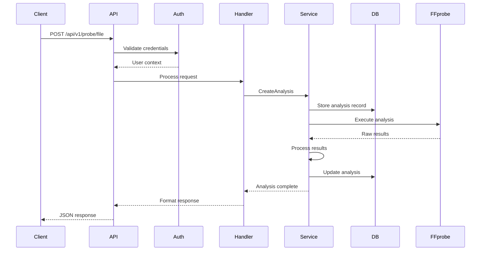
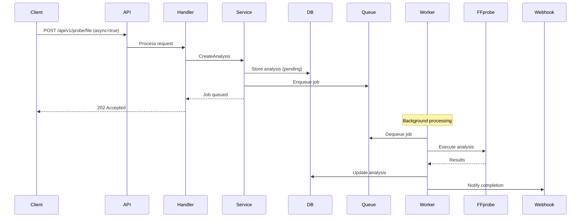

# System Architecture

> **Technical architecture and design documentation for FFprobe API**

## Architecture Overview

FFprobe API follows a microservices-oriented architecture with clear separation of concerns:

```
┌─────────────────────────────────────────────────────────────┐
│                        Client Layer                         │
│                   (Web, Mobile, API Clients)                │
└─────────────────┬───────────────────────────────────────────┘
                  │
┌─────────────────▼───────────────────────────────────────────┐
│                      API Gateway Layer                      │
│              (Authentication, Rate Limiting, CORS)          │
└─────────────────┬───────────────────────────────────────────┘
                  │
┌─────────────────▼───────────────────────────────────────────┐
│                    Application Layer                        │
│     ┌──────────────┐  ┌──────────────┐  ┌──────────────┐  │
│     │   Handlers   │  │   Services   │  │  Middleware  │  │
│     └──────────────┘  └──────────────┘  └──────────────┘  │
└─────────────────┬───────────────────────────────────────────┘
                  │
┌─────────────────▼───────────────────────────────────────────┐
│                      Data Layer                             │
│  ┌──────────┐  ┌──────────┐  ┌──────────┐  ┌──────────┐  │
│  │PostgreSQL│  │  Redis   │  │ Storage  │  │  FFmpeg  │  │
│  └──────────┘  └──────────┘  └──────────┘  └──────────┘  │
└─────────────────────────────────────────────────────────────┘
```

## Component Architecture

### API Layer (Gin Framework)

```go
// Router structure
api/
├── v1/
│   ├── auth/        # Authentication endpoints
│   ├── probe/       # Video analysis endpoints
│   ├── batch/       # Batch processing
│   ├── quality/     # Quality metrics
│   └── reports/     # Report generation
```

**Key Components:**
- **Router**: HTTP request routing and middleware chain
- **Handlers**: Request/response handling and validation
- **Middleware**: Auth, logging, rate limiting, CORS
- **Validators**: Input validation and sanitization

### Service Layer

```go
services/
├── AnalysisService    # Core video analysis logic
├── AuthService        # Authentication and authorization
├── QualityService     # Quality metrics calculation
├── ReportService      # Report generation
├── WorkerService      # Background job processing
└── LLMService         # AI integration
```

**Design Principles:**
- **Single Responsibility**: Each service handles one domain
- **Dependency Injection**: Services are injected, not instantiated
- **Interface-based**: Services implement interfaces for testing
- **Context-aware**: All operations accept context for cancellation

### Data Access Layer

```go
database/
├── Repository         # Data access abstraction
├── Migrations        # Schema versioning
├── Models           # Domain models
└── Queries          # SQL query builders
```

**Database Schema:**
```sql
-- Core tables
analyses
├── id (UUID, PK)
├── user_id (UUID, FK)
├── file_path (TEXT)
├── status (ENUM)
├── ffprobe_data (JSONB)
├── enhanced_analysis (JSONB)
├── quality_metrics (JSONB)
├── created_at (TIMESTAMP)
└── processed_at (TIMESTAMP)

users
├── id (UUID, PK)
├── email (VARCHAR, UNIQUE)
├── password_hash (VARCHAR)
├── role (ENUM)
├── api_key (VARCHAR, UNIQUE)
└── created_at (TIMESTAMP)

quality_metrics
├── id (UUID, PK)
├── analysis_id (UUID, FK)
├── vmaf_score (FLOAT)
├── psnr (FLOAT)
├── ssim (FLOAT)
└── created_at (TIMESTAMP)
```

## Design Patterns

### Repository Pattern

```go
type Repository interface {
    CreateAnalysis(ctx context.Context, analysis *models.Analysis) error
    GetAnalysis(ctx context.Context, id uuid.UUID) (*models.Analysis, error)
    UpdateAnalysis(ctx context.Context, analysis *models.Analysis) error
    DeleteAnalysis(ctx context.Context, id uuid.UUID) error
}

type PostgresRepository struct {
    db *sqlx.DB
}

func (r *PostgresRepository) CreateAnalysis(ctx context.Context, analysis *models.Analysis) error {
    query := `INSERT INTO analyses (id, user_id, file_path, status) 
              VALUES ($1, $2, $3, $4)`
    _, err := r.db.ExecContext(ctx, query, analysis.ID, analysis.UserID, 
                               analysis.FilePath, analysis.Status)
    return err
}
```

### Service Pattern

```go
type AnalysisService struct {
    repo     Repository
    ffprobe  *ffmpeg.FFprobe
    logger   zerolog.Logger
}

func (s *AnalysisService) ProcessAnalysis(ctx context.Context, id uuid.UUID) error {
    // Business logic here
    analysis, err := s.repo.GetAnalysis(ctx, id)
    if err != nil {
        return err
    }
    
    result, err := s.ffprobe.Analyze(ctx, analysis.FilePath)
    if err != nil {
        return err
    }
    
    analysis.FFprobeData = result
    return s.repo.UpdateAnalysis(ctx, analysis)
}
```

### Middleware Chain

```go
func SetupMiddleware(router *gin.Engine) {
    router.Use(
        middleware.RequestID(),        // Add request ID
        middleware.Logger(),           // Structured logging
        middleware.Recovery(),         // Panic recovery
        middleware.CORS(),            // CORS headers
        middleware.RateLimiter(),     // Rate limiting
        middleware.Authentication(),  // Auth validation
    )
}
```

## Data Flow

### Synchronous Analysis Flow



### Asynchronous Analysis Flow



## Scalability Design

### Horizontal Scaling

```yaml
# docker-compose.scale.yml
services:
  rendiff-probe:
    deploy:
      replicas: 3
      resources:
        limits:
          cpus: '2'
          memory: 4G
    environment:
      - INSTANCE_ID=${HOSTNAME}
      
  nginx:
    image: nginx:alpine
    volumes:
      - ./nginx.conf:/etc/nginx/nginx.conf
    depends_on:
      - rendiff-probe
```

### Load Balancing

```nginx
upstream ffprobe_api {
    least_conn;
    server rendiff-probe-1:8080 weight=1;
    server rendiff-probe-2:8080 weight=1;
    server rendiff-probe-3:8080 weight=1;
}

server {
    listen 80;
    location / {
        proxy_pass http://ffprobe_api;
        proxy_set_header X-Real-IP $remote_addr;
    }
}
```

### Caching Strategy

```go
// Redis caching layer
type CacheService struct {
    client *redis.Client
    ttl    time.Duration
}

func (c *CacheService) GetAnalysis(ctx context.Context, id string) (*models.Analysis, error) {
    // Try cache first
    data, err := c.client.Get(ctx, fmt.Sprintf("analysis:%s", id)).Bytes()
    if err == nil {
        var analysis models.Analysis
        json.Unmarshal(data, &analysis)
        return &analysis, nil
    }
    
    // Cache miss - fetch from database
    return nil, redis.Nil
}

func (c *CacheService) SetAnalysis(ctx context.Context, analysis *models.Analysis) error {
    data, _ := json.Marshal(analysis)
    return c.client.Set(ctx, fmt.Sprintf("analysis:%s", analysis.ID), 
                        data, c.ttl).Err()
}
```

## Security Architecture

### Authentication Flow

```go
// JWT authentication
type AuthMiddleware struct {
    jwtSecret []byte
}

func (m *AuthMiddleware) Authenticate(c *gin.Context) {
    token := c.GetHeader("Authorization")
    if token == "" {
        token = c.GetHeader("X-API-Key")
    }
    
    claims, err := m.ValidateToken(token)
    if err != nil {
        c.AbortWithStatus(401)
        return
    }
    
    c.Set("user_id", claims.UserID)
    c.Set("role", claims.Role)
    c.Next()
}
```

### Authorization

```go
// Role-based access control
func RequireRole(roles ...string) gin.HandlerFunc {
    return func(c *gin.Context) {
        userRole := c.GetString("role")
        
        for _, role := range roles {
            if userRole == role {
                c.Next()
                return
            }
        }
        
        c.AbortWithStatus(403)
    }
}

// Usage
router.POST("/admin/users", RequireRole("admin"), handlers.CreateUser)
```

## Performance Optimizations

### Connection Pooling

```go
// Database connection pool
db.SetMaxOpenConns(25)
db.SetMaxIdleConns(10)
db.SetConnMaxLifetime(5 * time.Minute)
db.SetConnMaxIdleTime(10 * time.Minute)

// Redis connection pool
redis.NewClient(&redis.Options{
    PoolSize:     10,
    MinIdleConns: 5,
    MaxRetries:   3,
})
```

### Resource Management

```go
// Context with timeout
ctx, cancel := context.WithTimeout(context.Background(), 30*time.Second)
defer cancel()

// Goroutine pool
type WorkerPool struct {
    workers int
    jobs    chan Job
}

func (p *WorkerPool) Start() {
    for i := 0; i < p.workers; i++ {
        go p.worker()
    }
}

func (p *WorkerPool) worker() {
    for job := range p.jobs {
        job.Process()
    }
}
```

### Memory Management

```go
// Stream large files
func StreamVideo(w http.ResponseWriter, filePath string) error {
    file, err := os.Open(filePath)
    if err != nil {
        return err
    }
    defer file.Close()
    
    // Stream in chunks
    buffer := make([]byte, 1024*1024) // 1MB chunks
    for {
        n, err := file.Read(buffer)
        if err == io.EOF {
            break
        }
        w.Write(buffer[:n])
    }
    return nil
}
```

## Testing Architecture

### Unit Testing

```go
func TestAnalysisService_ProcessAnalysis(t *testing.T) {
    // Mock dependencies
    mockRepo := &MockRepository{}
    mockFFprobe := &MockFFprobe{}
    
    service := &AnalysisService{
        repo:    mockRepo,
        ffprobe: mockFFprobe,
    }
    
    // Test
    err := service.ProcessAnalysis(context.Background(), uuid.New())
    assert.NoError(t, err)
    assert.True(t, mockRepo.UpdateCalled)
}
```

### Integration Testing

```go
func TestAPI_Integration(t *testing.T) {
    // Setup test database
    db := setupTestDB(t)
    defer db.Close()
    
    // Setup test server
    router := setupRouter(db)
    server := httptest.NewServer(router)
    defer server.Close()
    
    // Test API call
    resp, err := http.Post(server.URL+"/api/v1/probe/file", 
                           "application/json", 
                           strings.NewReader(`{"file_path":"/test.mp4"}`))
    assert.NoError(t, err)
    assert.Equal(t, 200, resp.StatusCode)
}
```

## Deployment Architecture

### Container Architecture

```dockerfile
# Multi-stage build
FROM golang:1.21 AS builder
WORKDIR /app
COPY . .
RUN CGO_ENABLED=0 go build -o rendiff-probe

FROM alpine:3.19
RUN apk add --no-cache ffmpeg
COPY --from=builder /app/rendiff-probe /usr/local/bin/
EXPOSE 8080
CMD ["rendiff-probe"]
```

### Kubernetes Architecture

```yaml
apiVersion: apps/v1
kind: Deployment
metadata:
  name: rendiff-probe
spec:
  replicas: 3
  selector:
    matchLabels:
      app: rendiff-probe
  template:
    metadata:
      labels:
        app: rendiff-probe
    spec:
      containers:
      - name: rendiff-probe
        image: rendiff-probe:latest
        ports:
        - containerPort: 8080
        env:
        - name: DATABASE_URL
          valueFrom:
            secretKeyRef:
              name: db-secret
              key: url
        livenessProbe:
          httpGet:
            path: /health
            port: 8080
        readinessProbe:
          httpGet:
            path: /health
            port: 8080
```

---

## Next Steps

- [Development Setup](setup.md)
- [Testing Guide](testing.md)
- [API Documentation](../api/README.md)
- [Deployment Guide](../deployment/README.md)